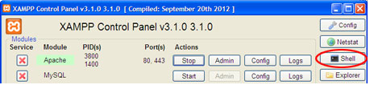

# PHPWebSocketChat - Simple Chat Using WebSocket JQuery PHP
The WebSocket is a feature of HTML5 for establishing a socket connections 
between a web browser and a server, once the connection has been established 
with the server, all WebSocket data (frames) are sent directly over a socket 
rather than usual HTTP response and requests, giving us much faster and 
persistent communication between a web browser and a server. Let’s create a 
simple chat system using this cool technology (HTML5 WebSocket and PHP)


https://www.sanwebe.com/2013/05/chat-using-websocket-php-socket


### Browser Support
Old browsers do not support WebSockets, you need latest browser that supports HTML5 WebSocket features, Please see caniuse.com to find-out all WebSocket supported browsers.

### Getting Started with WebSocket
Client side WebSocket implementation is very easy, the entire code consist of few methods and events. Have a look at code below for example.

```JAVASCRIPT
var wsUri = "ws://localhost:9000/daemon.php";
//create a new WebSocket object.
websocket = new WebSocket(wsUri); 
websocket.onopen = function(evt) { /* do stuff */ }; //on open event
websocket.onclose = function(evt) { /* do stuff */ }; //on close event
websocket.onmessage = function(evt) { /* do stuff */ }; //on message event
websocket.onerror = function(evt) { /* do stuff */ }; //on error event
websocket.send(message); //send method
websocket.close(); //close method
/*
To open the socket connection, we simply call new WebSocket(ws://SERVER URL), 
since WebSocket uses a different protocol for the connections, we use ws:// 
instead of http://, followed by host, port number and daemon script in your 
server:
*/


```

Right after opening the connection, we need to attach some event handlers that let us know status of connectivity, errors and incoming messages, for your references:

WebSocket(wsUri) — creates a new WebSocket object.

- onopen — Event occurs when connection is established.
- onclose — Event occurs when connection is closed.
- onmessage — Event occurs when client receives data from server.
- onerror — Event occurs when there is an error.
- send(message) — Transmits data to server using open connection.
- close() — Terminates existing connection.

### You can implement WebSocket with jQuery support in your webpage like this.
```JAVASCRIPT
$(document).ready(function(){
    //Open a WebSocket connection.
    var wsUri = "ws://localhost:9000/daemon.php";   
    websocket = new WebSocket(wsUri); 
    
    //Connected to server
    websocket.onopen = function(ev) {
        alert('Connected to server ');
    }
    
    //Connection close
    websocket.onclose = function(ev) { 
        alert('Disconnected');
    };
    
    //Message Receved
    websocket.onmessage = function(ev) { 
        alert('Message '+ev.data);
    };
    
    //Error
    websocket.onerror = function(ev) { 
        alert('Error '+ev.data);
    };
    
     //Send a Message
    $('#send').click(function(){ 
        var mymessage = 'This is a test message'; 
        websocket.send(mymessage);
    });
});
```
### Chat Page
As explained in examples above, we start by creating a WebSocket object, attaching event handlers and then using websocket.send() method to send the data. Since we are sending a collection of chat values, such as user name, message, color etc, we’ll convert our data to JSON format before sending to server.

```JAVASCRIPT
$(document).ready(function(){
    //create a new WebSocket object.
    var wsUri = "ws://localhost:9000/daemon.php";   
    websocket = new WebSocket(wsUri); 
    
    websocket.onopen = function(ev) { // connection is open 
        $('#message_box').append("<div class="system_msg">Connected!</div>"); //notify user
    }

    $('#send-btn').click(function(){ //use clicks message send button   
        var mymessage = $('#message').val(); //get message text
        var myname = $('#name').val(); //get user name
        
        if(myname == ""){ //empty name?
            alert("Enter your Name please!");
            return;
        }
        if(mymessage == ""){ //emtpy message?
            alert("Enter Some message Please!");
            return;
        }
        
        //prepare json data
        var msg = {
        message: mymessage,
        name: myname,
        color : '<?php echo $colours[$user_colour]; ?>'
        };
        //convert and send data to server
        websocket.send(JSON.stringify(msg));
    });
    
    //#### Message received from server?
    websocket.onmessage = function(ev) {
        var msg = JSON.parse(ev.data); //PHP sends Json data
        var type = msg.type; //message type
        var umsg = msg.message; //message text
        var uname = msg.name; //user name
        var ucolor = msg.color; //color

        if(type == 'usermsg') 
        {
            $('#message_box').append("<div><span class="user_name" style="color:#"+ucolor+"">"+uname+"</span> : <span class="user_message">"+umsg+"</span></div>");
        }
        if(type == 'system')
        {
            $('#message_box').append("<div class="system_msg">"+umsg+"</div>");
        }
        
        $('#message').val(''); //reset text
    };
    
    websocket.onerror   = function(ev){$('#message_box').append("<div class="system_error">Error Occurred - "+ev.data+"</div>");}; 
    websocket.onclose   = function(ev){$('#message_box').append("<div class="system_msg">Connection Closed</div>");}; 
});
```

### Below is our HTML for the chat system, it comes with some basic styling, I have not included the CSS part here, but you should find it in sample file.
```HTML
<div class="chat_wrapper">
<div class="message_box" id="message_box"></div>
<div class="panel">
<input type="text" name="name" id="name" placeholder="Your Name" maxlength="10" style="width:20%"  />
<input type="text" name="message" id="message" placeholder="Message" maxlength="80" style="width:60%" />
<button id="send-btn">Send</button>
</div>
</div>
```

### Chat Server using PHP Socket
Ok! Now we have our chat page ready to connect to server, but we also need to create a WebSocket server that runs permanently (no time-outs), performs WebSocket handshaking, send/receive data from chat page and handles multiple clients, for that we will create a daemon script in PHP. Everyone knows PHP is mostly used to create dynamic webpages, but most of us didn’t know that we can also create daemons (that run in the background) using nothing but PHP.

### Install WebSocket Server
Install a local web server such as WAMP or XAMPP. I am using XAMPP server on Win-XP, it lets me use shell option to start my daemon script. If you want to implement it on your website, first check whether your host allows you to run daemon scripts and shell commands.  I am not sure if WAMP has the same feature, but you can do the following to run this server script:

```
For those with Xampp and no shell option in the control panel (like me) you can do:
Open windows prompt (cmd), use cd command to open C:\xampp\php
From there, you can type something like: php.exe -q ../htdocs/path-to-chat-example/server.php

Alternatively, if you have php.exe included in your enviroment vars, just type anywhere in the prompt:
php -q C:\full-path-to-example\server.php

Now I have a question, wich commands will you use to run the server.php script as a true daemon? Because in my hosting seems that it just keep alive one or two minutes, then have to rerun command
```



### PHP Socket Steps
We will be using PHP socket to create our WebSocket Chat server, Basically our PHP Chat server should do the following.

1. Open a socket.
2. Bind to a address.
3. Listen incoming connections.
4. Accept connections.
5. WebSocket Handshake.
6. Unmask/Encode data frames.

### Open a socket:
First we create a socket with PHP socket_create(Domain, Type, Protocol) like this:

```PHP
//Create TCP/IP sream socket and return the socket resource
$socket = socket_create(AF_INET, SOCK_STREAM, SOL_TCP);
```

### Bind to a address:
Bind the name to the socket, this has to be done before a connection is established using socket_connect() or socket_listen().

```PHP
// Bind the source address
socket_bind($socket, 'localhost');
```

### Listen incoming connections:
Once the socket is created, we want our server to listen to incoming connection on that socket.

```PHP
// Listen to incoming connection
socket_listen($socket);
```

### Accept connections:
This function will accept incoming connections.

```PHP
// Accept new connections
socket_accept($socket);
```

### Handshake:
Client has to introduce itself by sending a WebSocket handshake request to establish a successful connection with server, a handshake request contains a Sec-WebSocket-Key a base64 encoded randomly generated 16-byte value. And the server reads the key, attaches magic string “258EAFA5-E914-47DA-95CA-C5AB0DC85B11”, hash key with SHA1, returns the key in Sec-WebSocket-Accept encoded with base64.